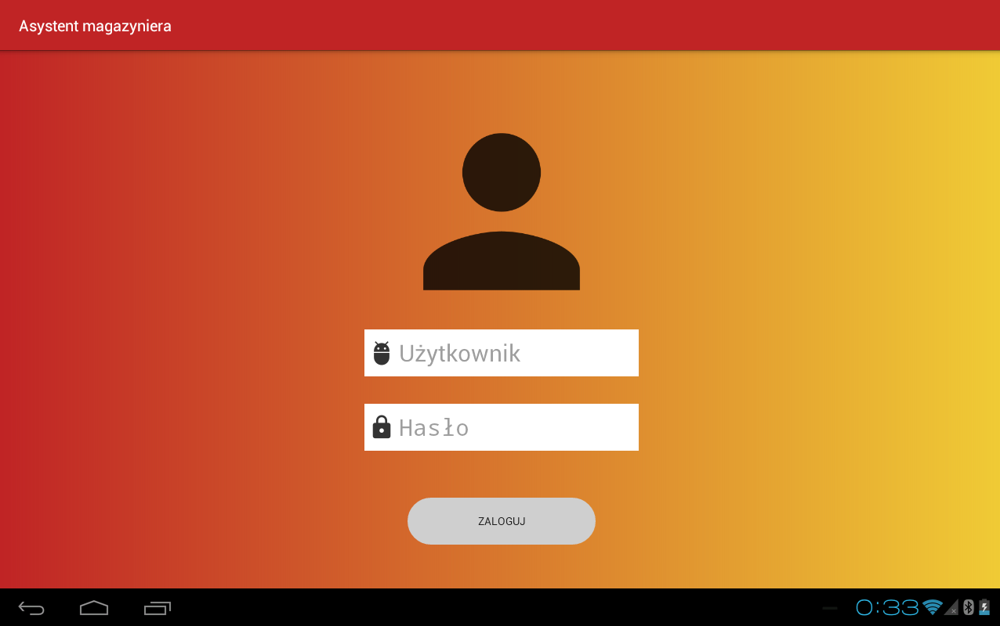
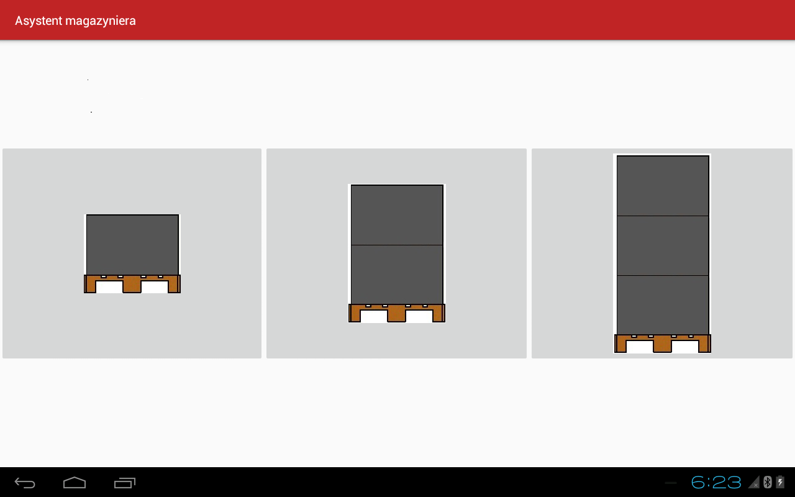
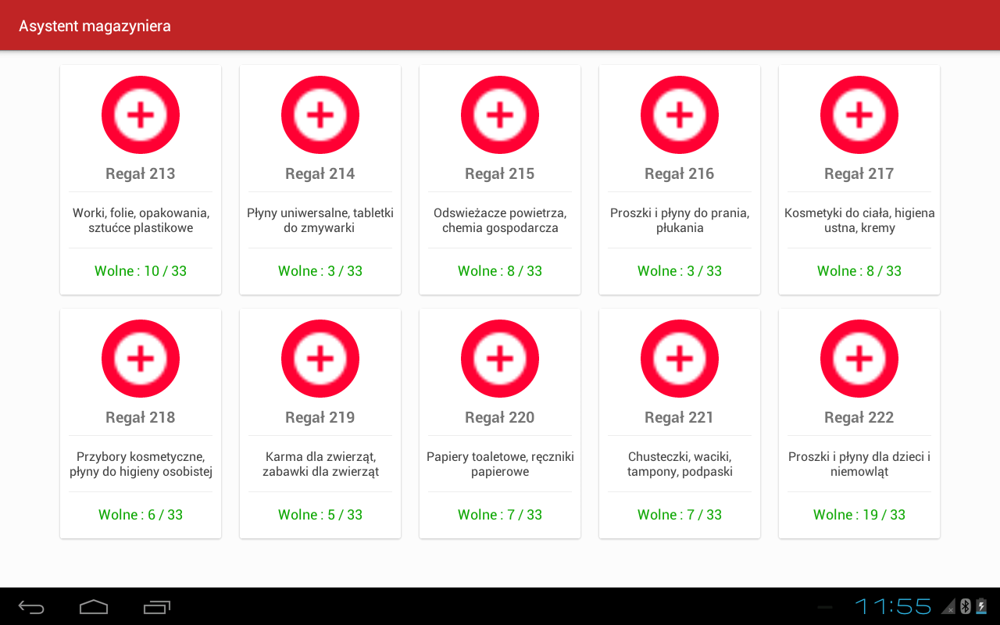
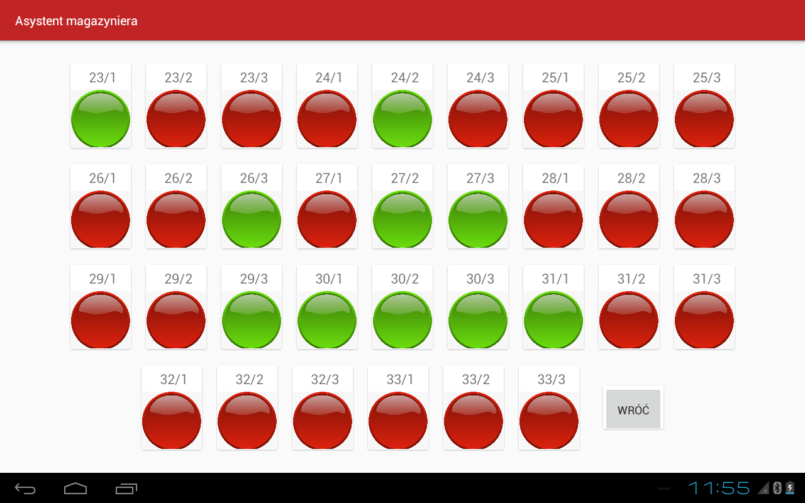
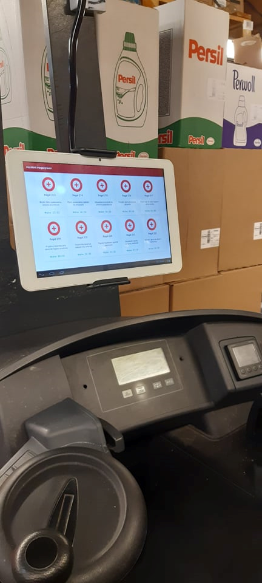

# Warehouse_assistant
WarehouseAssistant is a mobile application developed as part of an engineering project. The aim of the engineering project was to create a system for supporting the location of pallet nests using a mobile application. 
Finished application has the task to minimize duration of the ride from the point of adopted to the destinations. 

## Features
The task of the mobile application is to provide information about the free space for a pallet in the storage department in the easiest and fastest way. 
The sizes of the stocked pallets are divided into three types: small, medium and large. 
Each rack aisle has specifications and an empty space counter assigned to it.
The application consists of thirty-five activity classes:
- login window,
- main window,
- three windows with counters,
- thirty windows with controls.

## Interface

### Login window

The login window is the first class that appears when the application is started. It consists of two main components, such as an editor field (user and password) and a login button.

<p align="center">

</p>

One user has been assigned by means of a conditional function.

```java
public void dane_logowania(View view) {
        if (login.getText().toString().equals("Maj")&&
                password.getText().toString().equals("123")){
            Toast.makeText(getApplicationContext(),
                    "Zalogowno się na dział chemii gospodarczej",
                    Toast.LENGTH_LONG).show();
            Intent login = new Intent(MainActivity.this, glowne.class);
            startActivity(login);
        }else {
            Toast.makeText(getApplicationContext(),
                    "Niepoprawny login lub hasło",
                    Toast.LENGTH_LONG).show();
        }
    }
```

### Main window

At this point, the user selects the type of pallet that he wants to put on the warehouse rack.

<p align="center">

</p>

### Windows with counters

The mobile application was created for a place where all warehouse racks corresponded to a different type of product. To this end, I have created "cards" with information such as rack number, product types and the number of empty pallet spaces.

<p align="center">

</p>

```java
public void onClick(View v) {
        Intent i;

        switch (v.getId()) {
            case R.id.alejka_213 : i = new Intent(this,regal213.class);startActivity(i); break;
            case R.id.alejka_214 : i = new Intent(this,regal214.class);startActivity(i); break;
            case R.id.alejka_215 : i = new Intent(this,regal215.class);startActivity(i); break;
            case R.id.alejka_216 : i = new Intent(this,regal216.class);startActivity(i); break;
            case R.id.alejka_217 : i = new Intent(this,regal217.class);startActivity(i); break;
            case R.id.alejka_218 : i = new Intent(this,regal218.class);startActivity(i); break;
            case R.id.alejka_219 : i = new Intent(this,regal219.class);startActivity(i); break;
            case R.id.alejka_220 : i = new Intent(this,regal220.class);startActivity(i); break;
            case R.id.alejka_221 : i = new Intent(this,regal221.class);startActivity(i); break;
            case R.id.alejka_222 : i = new Intent(this,regal222.class);startActivity(i); break;
            default:break;
        }
    }
```

Using the SharedPreferences class, the data on the number of empty pallet spaces can be counted without being connected to the database.

```java
TextNum = (TextView) findViewById(R.id.TextNum);
SharedPreferences preferences = getSharedPreferences("PREFS",0);
lastScore = preferences.getInt("lastScore",0);
TextNum.setText("Wolne : " + lastScore + " / 33");
```

### Windows with controls

The controls reflect the pallet locations. If the indicator light is red, the pallet space is busy, if green, the space is empty.

<p align="center">

</p>

In brief, it is a switch button that changes the graphics and adds or subtracts the value of in counter.

```java
switch_button.setOnCheckedChangeListener(new Switch.OnCheckedChangeListener() {
            @Override
            public void onCheckedChanged(CompoundButton buttonView, boolean isChecked) {

                if (isChecked) {
                    imageView.setImageDrawable(getResources().getDrawable(R.drawable.button_on));
                    Toast.makeText(regal213.this,"Zwolniono",Toast.LENGTH_SHORT).show();
                    prefEditor.putString("checked","yes");
                    prefEditor.apply();
                    score += 1;
                    showT.setText("Score: " + score);
                }else{
                    imageView.setImageDrawable(getResources().getDrawable(R.drawable.button_off));
                    Toast.makeText(regal213.this,"Zajęto",Toast.LENGTH_SHORT).show();
                    prefEditor.putString("checked","false");
                    prefEditor.apply();
                    score -= 1;
                    showT.setText("Score: " + score);
                }
            }
        });
```
The button in the lower corner is responsible for returning to the menu and saving the value.

```java
pass.setOnClickListener(new View.OnClickListener() {
            @Override
            public void onClick(View v) {
                SharedPreferences preferences = getSharedPreferences("PREFS",0);
                SharedPreferences.Editor editor = preferences.edit();
                editor.putInt("lastScore",score);
                editor.apply();

                Intent intent = new Intent(getApplicationContext(),glowne.class);
                startActivity(intent);
                finish();

            }
        });
```

## Results

The mobile application was installed and tested in a cash and carry warehouse. This study investigated how much time need to assembling pallet storage with using application, as well as without. Using the designed mobile application, the time of this process can be shortened by up to 22%.

<p align="center">

</p>
